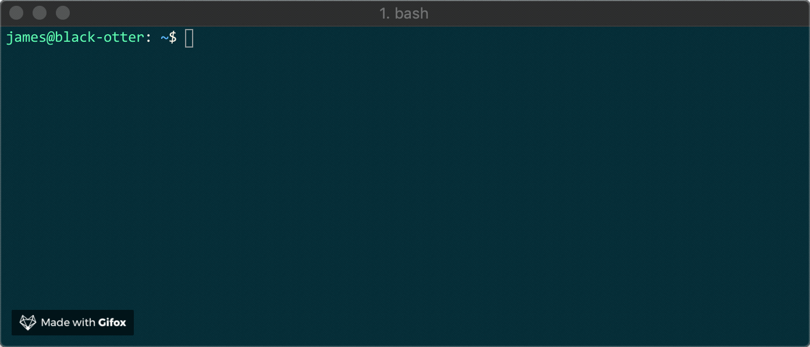

# cloudflare-workers-kv-viewer
Cloudflare Workers KV interactive viewer



## Install

`npm install cloudflare-workers-kv-viewer -g`

## Environment variables

```
CLOUDFLARE_AUTH_EMAIL # your cloudflare account email
CLOUDFLARE_AUTH_KEY # your cloudflare account api key
CLOUDFLARE_NAMESPACE_ID # your cloudflare account id
```

You can also set these with optional command line arguments if you prefer.

## Interactive vs Given

This is setup to guide you interactively into picking your key value but you can pass in the namespace or key value if you already know what you are looking for

```
cfkvi -h
Usage: cfkvi [options]

Options:
  --account-id <id>        Cloudflare Account ID
  --account-email <email>  Cloudflare Auth Email
  --account-key <key>      Cloudflare Auth Key
  -n, --namespace <ns>     Namespace
  -k, --key <key>          Key to get
  -l, --loop               Keep prompting for new values
  -h, --help               output usage information
```
